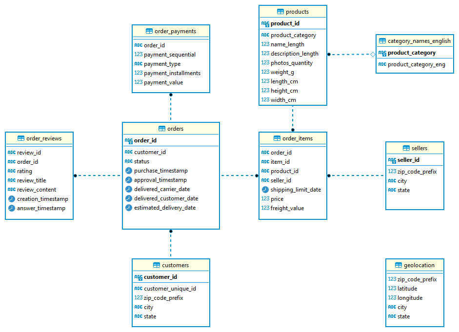

# Análise de Dados com PostgreSQL - Olist E-commerce

Projeto de análise exploratória utilizando **PostgreSQL** e o dataset público da **Olist**, disponível no Kaggle.

O objetivo é praticar consultas SQL voltadas para **Engenharia de Dados** e **Analytics**, explorando métricas de vendas, logística, clientes e desempenho operacional.

# Sobre o Dataset



O dataset contém aproximadamente **100 mil pedidos** realizados entre **2016 e 2018** em marketplaces brasileiros.

As informações incluem:

- Pedidos
- Clientes
- Produtos
- Vendedores
- Pagamentos
- Avaliações
- Geolocalização

Dataset original:

https://www.kaggle.com/datasets/olistbr/brazilian-ecommerce

---

# Tecnologias

- PostgreSQL
- SQL
- DBeaver
- Git
- GitHub

---

# Modelo de Dados

| Tabela | Descrição |
|---------|-----------|
| orders_dataset | Pedidos |
| customers_dataset | Clientes |
| order_items_dataset | Itens dos pedidos |
| products_dataset | Produtos |
| sellers_dataset | Vendedores |
| order_payments_dataset | Pagamentos |
| order_reviews_dataset | Avaliações |
| geolocation_dataset | Geolocalização |

---

# Relacionamentos

```
Customers
     │
     ▼
Orders
 ├────────► Payments
 ├────────► Reviews
 └────────► Order Items
               │
        ┌──────┴──────┐
        ▼             ▼
    Products      Sellers
```

---

# Objetivo

Este projeto faz parte dos meus estudos em:

- PostgreSQL
- SQL
- Engenharia de Dados
- Data Analytics

O foco é desenvolver consultas SQL utilizadas em cenários reais de análise de dados e e-commerce.


# Perguntas de Negócio

**QUAL A QUANTIDADE DE PEDIDOS POR STATUS**

```sql
select order_status, count(*) as total
from orders_dataset
group by order_status 
order by total desc;
```

R: A quantidade de pedidos por status:

| Status | Total de Pedidos |
|:------------|-----------------:|
| delivered | 96.478 |
| shipped | 1.107 |
| canceled | 625 |
| unavailable | 609 |
| invoiced | 314 |
| processing | 301 |
| created | 5 |
| approved | 2 |

**QUAL O TOP 10 DAS CATEGORIAS COM MAIOR FATURAMENTO**

```sql
select
	p.product_category_name, 
	ROUND(SUM(oi.price)::NUMERIC,2) AS faturamento
from order_items_dataset as oi
join products_dataset as p
on oi.product_id = p.product_id
group by p.product_category_name
order by faturamento desc
limit 10;
```

R: As top 10 categorias com maior faturamento foram:

| Ranking | Categoria |
|:--:|:-------------------------------|
| 1 | beleza_saude |
| 2 | relogios_presentes |
| 3 | cama_mesa_banho |
| 4 | esporte_lazer |
| 5 | informatica_acessorios |
| 6 | moveis_decoracao |
| 7 | cool_stuff |
| 8 | utilidades_domesticas |
| 9 | automotivo |
| 10 | ferramentas_jardim |

**QUAL É O TOTAL DA RECEITA POR CATEGORIA**

```sql
select 
pr.product_category_name,
round(sum(oi.price)::numeric,2) as receita
from order_items_dataset as oi
join products_dataset as pr
on oi.product_id = pr.product_id
group by pr.product_category_name
order by receita desc;
```

R: O total da receita por categoria foi de:

| Categoria | Receita (R$) |
|:----------|-------------:|
| beleza_saude | 1.258.681,34 |
| relogios_presentes | 1.205.005,68 |
| cama_mesa_banho | 1.036.988,68 |
| esporte_lazer | 988.048,97 |
| informatica_acessorios | 911.954,32 |
| moveis_decoracao | 729.762,49 |
| cool_stuff | 635.290,85 |
| utilidades_domesticas | 632.248,66 |
| automotivo | 592.720,11 |
| ferramentas_jardim | 485.256,46 |
| brinquedos | 483.946,60 |
| bebes | 411.764,89 |
| perfumaria | 399.124,87 |
| telefonia | 323.667,53 |
| moveis_escritorio | 273.960,70 |
| papelaria | 230.943,23 |
| pcs | 222.963,13 |
| pet_shop | 214.315,41 |
| instrumentos_musicais | 191.498,88 |
| eletroportateis | 190.648,58 |
| **Sem Categoria** | 179.535,28 |
| eletronicos | 160.246,74 |
| consoles_games | 157.465,22 |
| fashion_bolsas_e_acessorios | 152.823,54 |
| construcao_ferramentas_construcao | 144.677,59 |
| malas_acessorios | 140.429,98 |
| eletrodomesticos_2 | 113.317,74 |
| casa_construcao | 83.088,12 |
| eletrodomesticos | 80.171,53 |
| agro_industria_e_comercio | 72.530,47 |
| moveis_sala | 68.916,56 |
| telefonia_fixa | 59.583,00 |
| casa_conforto | 58.572,04 |
| climatizacao | 55.024,96 |
| audio | 50.688,50 |
| portateis_casa_forno_e_cafe | 47.445,71 |
| livros_interesse_geral | 46.856,88 |
| moveis_cozinha_area_de_servico_jantar_e_jardim | 46.328,37 |
| construcao_ferramentas_iluminacao | 41.080,00 |
| construcao_ferramentas_seguranca | 40.544,52 |
| industria_comercio_e_negocios | 39.669,61 |
| alimentos | 29.393,41 |
| market_place | 28.378,47 |
| construcao_ferramentas_jardim | 25.715,89 |
| artes | 24.202,64 |
| fashion_calcados | 23.562,77 |
| bebidas | 22.428,70 |
| sinalizacao_e_seguranca | 21.509,23 |
| moveis_quarto | 20.028,78 |
| livros_tecnicos | 19.096,06 |
| construcao_ferramentas_ferramentas | 15.903,95 |
| alimentos_bebidas | 15.179,48 |
| fashion_roupa_masculina | 10.797,82 |
| fashion_underwear_e_moda_praia | 9.541,55 |
| artigos_de_natal | 8.800,82 |
| tablets_impressao_imagem | 7.528,41 |
| cine_foto | 6.933,46 |
| musica | 6.034,35 |
| dvds_blu_ray | 5.999,39 |
| livros_importados | 4.639,85 |
| artigos_de_festas | 4.485,18 |
| moveis_colchao_e_estofado | 4.368,08 |
| portateis_cozinha_e_preparadores_de_alimentos | 3.968,53 |
| fashion_roupa_feminina | 2.803,64 |
| fashion_esporte | 2.119,51 |
| la_cuisine | 2.054,99 |
| artes_e_artesanato | 1.814,01 |
| fraldas_higiene | 1.567,59 |
| pc_gamer | 1.545,95 |
| flores | 1.110,04 |
| casa_conforto_2 | 760,27 |
| cds_dvds_musicais | 730,00 |
| fashion_roupa_infanto_juvenil | 569,85 |
| seguros_e_servicos | 283,29 |


**TOTAL DE PEDIDOS POR DIA DA SEMANA**

```sql
select 
to_char(order_purchase_timestamp::timestamp, 'Day') as dia,
count(*) as total
from orders_dataset
group by dia
order by total desc;
```

R: O total de pedidos por dia da semana foi de:

 | Day | Total Orders |
|:----------|------------:|
| Monday | 16,196 |
| Tuesday | 15,963 |
| Wednesday | 15,552 |
| Thursday | 14,761 |
| Friday | 14,122 |
| Sunday | 11,960 |
| Saturday | 10,887 |


**QUAL O TOP 10 DO TICKET MÉDIO POR CATEGORIA**

```sql
select p.product_category_name, 
       round(avg(oi.price)::numeric,2) as ticket_medio
from order_items_dataset as oi
join products_dataset as p
on oi.product_id = p.product_id
group by p.product_category_name
order by ticket_medio desc;
```

R: O top 10 do ticket médio por categoria são: 

| Ranking | Categoria | Ticket Médio (R$) |
|:--:|:--------------------------------------------|------------------:|
| 1 | pcs | 1.098,34 |
| 2 | portateis_casa_forno_e_cafe | 624,29 |
| 3 | eletrodomesticos_2 | 476,12 |
| 4 | agro_industria_e_comercio | 342,12 |
| 5 | instrumentos_musicais | 281,62 |
| 6 | eletroportateis | 280,78 |
| 7 | portateis_cozinha_e_preparadores_de_alimentos | 264,57 |
| 8 | telefonia_fixa | 225,69 |
| 9 | construcao_ferramentas_seguranca | 208,99 |
| 10 | relogios_presentes | 201,14 |

**QUAL O TOP 10 DAS CATEGORIAS COM MAIOR CUSTO DE FRETE**

```sql
elect p.product_category_name,
	   round(sum(oi.freight_value)::numeric,2) as frete_total
from order_items_dataset as oi
join products_dataset as p
on oi.product_id = p.product_id
group by p.product_category_name
order by frete_total desc;
```
R: O top das categorias com maior custo de frete são:

| Ranking | Categoria | Frete Total (R$) |
|:--:|:------------------------|-----------------:|
| 1 | cama_mesa_banho | 204.693,04 |
| 2 | beleza_saude | 182.566,73 |
| 3 | moveis_decoracao | 172.749,30 |
| 4 | esporte_lazer | 168.607,51 |
| 5 | informatica_acessorios | 147.318,08 |
| 6 | utilidades_domesticas | 146.149,11 |
| 7 | relogios_presentes | 100.535,93 |
| 8 | ferramentas_jardim | 98.962,75 |
| 9 | automotivo | 92.664,21 |
| 10 | cool_stuff | 84.039,10 |

**QUAL O TOP 10 DO PESO MÉDIO DOS PRODUTOS POR CATEGORIA**

```sql
select * from products_dataset limit 10;

select product_category_name,
       round(avg(product_weight_g)::numeric, 2) as peso_medio
from products_dataset 
group by product_category_name
order by peso_medio desc;
```

R: O top 10 do peso médio dos produtos por categoria são: 

| Ranking | Categoria | Peso Médio (g) |
|:--:|:----------------------------------------------|---------------:|
| 1 | moveis_colchao_e_estofado | 13.190,00 |
| 2 | moveis_escritorio | 12.740,87 |
| 3 | moveis_cozinha_area_de_servico_jantar_e_jardim | 11.598,56 |
| 4 | moveis_quarto | 9.997,22 |
| 5 | eletrodomesticos_2 | 9.913,33 |
| 6 | moveis_sala | 8.934,85 |
| 7 | pcs | 7.995,33 |
| 8 | industria_comercio_e_negocios | 5.929,19 |
| 9 | agro_industria_e_comercio | 5.263,41 |
| 10 | climatizacao | 4.459,96 |

**QUAL O TOP 10 DAS CATEGORIAS COM PIOR AVALIAÇÃO**

```sql
select p.product_category_name,
       round(avg(r.review_score)::numeric,2) as nota_media
from order_items_dataset as o
join products_dataset as p
on o.product_id = p.product_id
join order_reviews_dataset as r
on o.order_id = r.order_id
group by p.product_category_name
order by nota_media desc;
```

R: O top 10 das categorias com pior avaliação são: 

| Ranking | Categoria | Nota Média |
|:--:|:--------------------------------|-----------:|
| 1 | cds_dvds_musicais | 4,64 |
| 2 | fashion_roupa_infanto_juvenil | 4,50 |
| 3 | livros_interesse_geral | 4,45 |
| 4 | construcao_ferramentas_ferramentas | 4,44 |
| 5 | flores | 4,42 |
| 6 | livros_importados | 4,40 |
| 7 | livros_tecnicos | 4,37 |
| 8 | malas_acessorios | 4,32 |
| 9 | alimentos_bebidas | 4,32 |
| 10 | portateis_casa_forno_e_cafe | 4,30 |

**QUAL A RECEITA POR ESTADO**

```sql
select
c.customer_state, 
sum(p.payment_value) as receita
from orders_dataset as o
join customers_dataset as c
on o.customer_id = c.customer_id
join order_payments_dataset as p
on o.order_id = p.order_id
group by c.customer_state
order by receita desc;
```

R: A RECEITA POR ESTADO FOI:

| Estado | Receita (R$) |
|:-------|-------------:|
| SP | 5.998.226,96 |
| RJ | 2.144.379,69 |
| MG | 1.872.257,26 |
| RS | 890.898,54 |
| PR | 811.156,38 |
| SC | 623.086,43 |
| BA | 616.645,82 |
| DF | 355.141,08 |
| GO | 350.092,31 |
| ES | 325.967,55 |
| PE | 324.850,44 |
| CE | 279.464,03 |
| PA | 218.295,85 |
| MT | 187.029,29 |
| MA | 152.523,02 |
| PB | 141.545,72 |
| MS | 137.534,84 |
| PI | 108.523,97 |
| RN | 102.718,13 |
| AL | 96.962,06 |
| SE | 75.246,25 |
| TO | 61.485,33 |
| RO | 60.866,20 |
| AM | 27.966,93 |
| AC | 19.680,62 |
| AP | 16.262,80 |
| RR | 10.064,62 |

**QUAL O TICKET MÉDIO POR ESTADO**

```sql
select 
c.customer_state, 
avg(p.payment_value) as ticket_medio
from orders_dataset as o
join customers_dataset as c
on o.customer_id = c.customer_id
join order_payments_dataset as p
on o.order_id = p.order_id
group by c.customer_state
order by ticket_medio desc;
```

R: O TICKET MÉDIO POR ESTADO FOI DE:

| Estado | Ticket Médio (R$) |
|:-------|------------------:|
| PB | 248,33 |
| AC | 234,29 |
| RO | 233,20 |
| AP | 232,33 |
| AL | 227,08 |
| RR | 218,80 |
| PA | 215,92 |
| SE | 208,44 |
| PI | 207,11 |
| TO | 204,27 |
| CE | 199,90 |
| MA | 198,86 |
| RN | 196,78 |
| MT | 195,23 |
| PE | 187,99 |
| MS | 186,87 |
| AM | 181,60 |
| BA | 170,82 |
| SC | 165,98 |
| GO | 165,76 |
| DF | 161,13 |
| RJ | 158,53 |
| RS | 157,18 |
| ES | 154,71 |
| MG | 154,71 |
| PR | 154,15 |
| SP | 137,50 |


**QUAL O TOP 10 DO TEMPO MÉDIO DE ENTREGA POR ESTADO**

```sql
select c.customer_state,
       avg(o.order_delivered_customer_date::timestamp - o.order_purchase_timestamp::timestamp) as tempo_medio
from orders_dataset as o
join customers_dataset as c
on o.customer_id = c.customer_id
where order_status = 'delivered'
group by customer_state
order by tempo_medio desc;
```

R: O top 10 do tempo médio de entrega por estado são:

| Ranking | Estado | Tempo Médio |
|:--:|:------:|:----------------------|
| 1 | RR | 28 dias |
| 2 | AP | 26 dias |
| 3 | AM | 25 dias |
| 4 | AL | 24 dias |
| 5 | PA | 23 dias |
| 6 | MA | 21 dias |
| 7 | SE | 21 dias |
| 8 | CE | 20 dias |
| 9 | AC | 20 dias |
| 10 | PB | 19 dias |

**QUAL O TOP 10 DOS ESTADOS QUE MAIS COMPRARAM**

```sql
select 
customer_state, 
count(*) as pedidos
from customers_dataset as c
join orders_dataset as o
on c.customer_id = o.customer_id
group by customer_state 
order by pedidos desc;
```

R: O top 10 dos estados que mais compraram foram: 

| Ranking | Estado | Pedidos |
|:--:|:------:|--------:|
| 1 | SP | 41.746 |
| 2 | RJ | 12.852 |
| 3 | MG | 11.635 |
| 4 | RS | 5.466 |
| 5 | PR | 5.045 |
| 6 | SC | 3.637 |
| 7 | BA | 3.380 |
| 8 | DF | 2.140 |
| 9 | ES | 2.033 |
| 10 | GO | 2.020 |

**TOP 10 DOS CLIENTES COM MAIOR GASTO**

```sql
select o.customer_id, 
       round(sum(payment_value)::numeric, 2) as total_gasto
from orders_dataset as o
join order_payments_dataset as p
on o.order_id = p.order_id
group by customer_id
order by total_gasto desc
limit 20;
```

R: O top 10 dos clientes com maior gasto foram: 

| Ranking | Customer ID | Total Gasto (R$) |
|:--:|:----------------------------------|-----------------:|
| 1 | 1617b1357756262bfa56ab541c47bc16 | 13.664,08 |
| 2 | ec5b2ba62e574342386871631fafd3fc | 7.274,88 |
| 3 | c6e2731c5b391845f6800c97401a43a9 | 6.929,31 |
| 4 | f48d464a0baaea338cb25f816991ab1f | 6.922,21 |
| 5 | 3fd6777bbce08a352fddd04e4a7cc8f6 | 6.726,66 |
| 6 | 05455dfa7cd02f13d132aa7a6a9729c6 | 6.081,54 |
| 7 | df55c14d1476a9a3467f131269c2477f | 4.950,34 |
| 8 | e0a2412720e9ea4f26c1ac985f6a7358 | 4.809,44 |
| 9 | 24bbf5fd2f2e1b359ee7de94defc4a15 | 4.764,34 |
| 10 | 3d979689f636322c62418b6346b1c6d2 | 4.681,78 |

**QUAL FOI A FORMA DE PAGAMENTO MAIS UTILIZADA**

```sql
select
payment_type, 
count(*) as quantidade
from order_payments_dataset
group by payment_type
order by quantidade desc;
```
R: As formas de pagamento mais utilizadas foram: 

| Forma de Pagamento | Quantidade |
|:-------------------|----------:|
| Credit Card | 76.795 |
| Boleto | 19.784 |
| Voucher | 5.775 |
| Debit Card | 1.529 |
| Not Defined | 3 |

**QUAL FOI A MÉDIA DOS PARCELAMENTOS**

```sql
select 
payment_type,
round(avg(payment_installments)::numeric, 2) as parcelas
from order_payments_dataset
group by payment_type;
```

R: A média dos parcelamentos foi de:

| Forma de Pagamento | Média de Parcelas |
|:-------------------|------------------:|
| Credit Card | 3,51 |
| Boleto | 1,00 |
| Debit Card | 1,00 |
| Voucher | 1,00 |
| Not Defined | 1,00 |

**QUAL FOI O TOP 10 DO RANKING DOS VENDEDORES**

```sql
select seller_id, 
round(sum(price)::numeric, 2) as faturamento
from order_items_dataset
group by seller_id
order by faturamento desc;
```

R: O top 10 do ranking dos vendedores foram:

| Ranking | Seller ID | Faturamento (R$) |
|:--:|:----------------------------------|-----------------:|
| 1 | 4869f7a5dfa277a7dca6462dcf3b52b2 | 229.472,63 |
| 2 | 53243585a1d6dc2643021fd1853d8905 | 222.776,05 |
| 3 | 4a3ca9315b744ce9f8e9374361493884 | 200.472,92 |
| 4 | fa1c13f2614d7b5c4749cbc52fecda94 | 194.042,03 |
| 5 | 7c67e1448b00f6e969d365cea6b010ab | 187.923,89 |
| 6 | 7e93a43ef30c4f03f38b393420bc753a | 176.431,87 |
| 7 | da8622b14eb17ae2831f4ac5b9dab84a | 160.236,57 |
| 8 | 7a67c85e85bb2ce8582c35f2203ad736 | 141.745,53 |
| 9 | 1025f0e2d44d7041d6cf58b6550e0bfa | 138.968,55 |
| 10 | 955fee9216a65b617aa5c0531780ce60 | 135.171,70 |


**QUAL O TOP 10 DA QUANTIDADE DE PEDIDOS POR VENDEDOR**

```sql
select seller_id, count(distinct order_id) as pedidos
from order_items_dataset
group by seller_id 
order by pedidos desc;
```

R: O top 10 da quantidade de pedidos por vendedor foram:

| Ranking | Seller ID | Pedidos |
|:--:|:----------------------------------|--------:|
| 1 | 6560211a19b47992c3666cc44a7e94c0 | 1.854 |
| 2 | 4a3ca9315b744ce9f8e9374361493884 | 1.806 |
| 3 | cc419e0650a3c5ba77189a1882b7556a | 1.706 |
| 4 | 1f50f920176fa81dab994f9023523100 | 1.404 |
| 5 | da8622b14eb17ae2831f4ac5b9dab84a | 1.314 |
| 6 | 955fee9216a65b617aa5c0531780ce60 | 1.287 |
| 7 | 7a67c85e85bb2ce8582c35f2203ad736 | 1.160 |
| 8 | ea8482cd71df3c1969d7b9473ff13abc | 1.146 |
| 9 | 4869f7a5dfa277a7dca6462dcf3b52b2 | 1.132 |
| 10 | 3d871de0142ce09b7081e2b9d1733cb1 | 1.080 |

**QUAL O TOP 10 DA RECEITA POR MÊS**

```sql
select
date_trunc('month', order_purchase_timestamp::timestamp ) as mes,
round(sum(payment_value)::numeric, 2) as receita
from orders_dataset as o
join order_payments_dataset as p
on o.order_id = p.order_id
group by mes
order by receita desc;
```

R: O top 10 da receita por mês foi:

| Ranking | Mês | Receita (R$) |
|:--:|:---------|-------------:|
| 1 | 2017-11 | 1.194.882,80 |
| 2 | 2018-04 | 1.160.785,48 |
| 3 | 2018-03 | 1.159.652,12 |
| 4 | 2018-05 | 1.153.982,15 |
| 5 | 2018-01 | 1.115.004,18 |
| 6 | 2018-07 | 1.066.540,75 |
| 7 | 2018-06 | 1.023.880,50 |
| 8 | 2018-08 | 1.022.425,32 |
| 9 | 2018-02 | 992.463,34 |


**COMO FOI O CRESCIMENTO MENSAL EM TODO O PERÍODO**

```sql
with receita as(

	select date_trunc('month', order_purchase_timestamp::timestamp) as mes,
	sum(payment_value) as receita
	from orders_dataset as o
	join order_payments_dataset as p
	on o.order_id = p.order_id
	group by mes
)

select mes, receita, lag(receita) over(order by mes) as receita_anterior, 
       receita - lag(receita) over(order by mes) as crescimento from receita;
```

R: O crescimento mensal em todo o período foi: 

| Mês | Receita (R$) | Receita Anterior (R$) | Crescimento (R$) |
|:-----|-------------:|----------------------:|-----------------:|
| 2016-09 | 252,24 | - | - |
| 2016-10 | 59.090,48 | 252,24 | 58.838,24 |
| 2016-12 | 19,62 | 59.090,48 | -59.070,86 |
| 2017-01 | 138.488,04 | 19,62 | 138.468,42 |
| 2017-02 | 291.908,01 | 138.488,04 | 153.419,97 |
| 2017-03 | 449.863,60 | 291.908,01 | 157.955,59 |
| 2017-04 | 417.788,03 | 449.863,60 | -32.075,57 |
| 2017-05 | 592.918,82 | 417.788,03 | 175.130,79 |
| 2017-06 | 511.276,38 | 592.918,82 | -81.642,44 |
| 2017-07 | 592.382,92 | 511.276,38 | 81.106,54 |
| 2017-08 | 674.396,32 | 592.382,92 | 82.013,40 |
| 2017-09 | 727.762,45 | 674.396,32 | 53.366,13 |
| 2017-10 | 779.677,88 | 727.762,45 | 51.915,43 |
| 2017-11 | 1.194.882,80 | 779.677,88 | 415.204,92 |
| 2017-12 | 878.401,48 | 1.194.882,80 | -316.481,32 |
| 2018-01 | 1.115.004,18 | 878.401,48 | 236.602,70 |
| 2018-02 | 992.463,34 | 1.115.004,18 | -122.540,84 |
| 2018-03 | 1.159.652,12 | 992.463,34 | 167.188,78 |
| 2018-04 | 1.160.785,48 | 1.159.652,12 | 1.133,36 |
| 2018-05 | 1.153.982,15 | 1.160.785,48 | -6.803,33 |
| 2018-06 | 1.023.880,50 | 1.153.982,15 | -130.101,65 |
| 2018-07 | 1.066.540,75 | 1.023.880,50 | 42.660,25 |
| 2018-08 | 1.022.425,32 | 1.066.540,75 | -44.115,43 |
| 2018-09 | 4.439,54 | 1.022.425,32 | -1.017.985,78 |
| 2018-10 | 589,67 | 4.439,54 | -3.849,87 |
